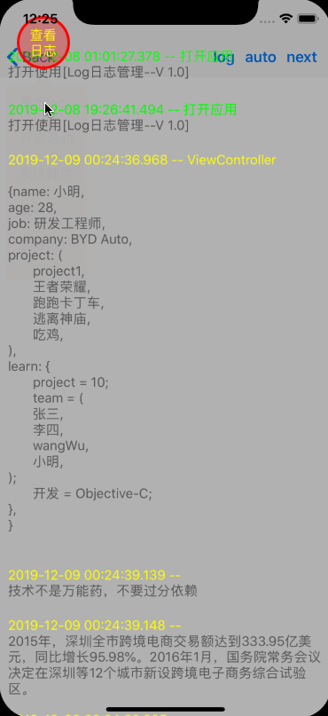

# SYLogManager
log日志查看工具。

### 特点：
* log日志实时显示
* log日志显示时，可设置界面交互，或禁止界面交互
* log日志缓存在本地
* log日志可复制，并粘贴到其他应用，如微信，QQ 等
* log日志可发送邮件
* log 日志可清空
* log 日志除自定义信息外，还定制实现了 crash 信息，并显示相关的设备等信息。

> `查看日志`按钮可拖动的任意位置

# 使用介绍
* 自动导入：使用命令`pod 'SYLogManager'`导入到项目中
* 手动导入：或下载源码后，将源码添加到项目中

# 代码示例
~~~ javascript
// 导入头文件
#import "SYLogManager.h"
~~~

~~~ javascript
// 初始化配置
[SYLogManager.shareLog config];
SYLogManager.shareLog.email = @"151311301@qq.com";

// 显示等设置
SYLogManager.shareLog.show = YES;
SYLogManager.shareLog.controller = self.window.rootViewController;

// 使用
[SYLogManager.shareLog logText:@"hello world~"];
[SYLogManager.shareLog logText:@"hello world~" key:@"001")];
~~~ 

效果图

 

# 修改完善
* 20191207
  * 版本号：1.2.0
  * 修改优化
    * 修改缓存处理（sqlite）
    * 优化交互界面
      * 操作菜单自适应：显示/隐藏、滚动响应、删除、复制、发邮件
      * 实时显示
      * 显示过程中可操作，或禁止操作

* 20191126
  * 版本号：1.1.3
  * 修改完善
    * 新增联调/模拟器模式开关
    * 修改log缓存默认目录
    * 打开时显示滚动后的位置

* 20190916
  * 版本号：1.1.2
  * 修改完善
  
* 20190901
  * 版本号：1.1.1
  * 修改优化
    * 初始化log接收邮件地址

* 20190725
  * 版本号：1.1.0
  * 功能完善
    * 新增拖动时关闭悬浮窗口
    
* 20190521
  * 版本号：1.0.7 1.0.8 1.0.9
  * 功能完善
    * 发送邮件
    
* 20190425
  * 版本号：1.0.6
  * 功能完善
  
* 20190417
  * 版本号：1.0.2 1.0.3 1.0.4 1.0.5
  * 功能完善
    * 显示对象信息
    
* 20190416
  * 版本号：1.0.0 1.0.1
  * 添加源码